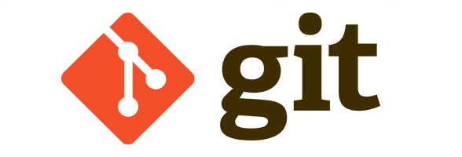

:::::::::::::::::::::::::::::::::::::: questions 

- What are the goals of this course?

::::::::::::::::::::::::::::::::::::::::::::::::

::::::::::::::::::::::::::::::::::::: objectives

- To understand the learning outcomees of this course
- To understand the structure of the practicals

::::::::::::::::::::::::::::::::::::::::::::::::

# What is Version Control?

Any means by which you track changes to something:

{alt="Four Python files named:
work.py, work_final.py, work_final_2.py, work_final_2_really_final.py"}

## What is Version Control?

- Structured way of keeping track of changes to files
- Implemented in different \"version control systems\" (VCS)
- Typically share the concept of a history, the  changes which make up the history , and the ability to move freely back and forth within the history
- The most popular VCS is  git , which we will be focusing on today

## Why Version Control?

- Keeps a labelled history of all changes made to a project, and lets you rewind them if something goes wrong
- Lets you experiment with changes to a project whilst keeping stable versions of the project untouched
- Provides lots of convenience features for working with other people on a project
- Can act as a backup of your projects, especially when using a hosted service like GitHub
- Many tools (like IDEs) have git integrations

## What is git?

- A specific version control system, created by the guy who created the Linux kernel (the myth goes that he named it by his personal reputation)
- A \"distributed\" version control system - many people can have copies of the stuff under version control and they don't need to all be in sync
- One of the most important programming tools you can benefit from becoming comfortable with

{alt="Git logo"}

## What is GitHub?

- A  service for hosting, organising, and collaborating on projects that are under version control

<!-- -->

- Other git services are available

<!-- -->

- Provides a consistent way to store and share version-controlled projects
- Can act as a portfolio of sorts
- Has a whole host of other features (project management, continuous integration, etc.)
- See the  PlasmaFAIR GitHub organisation  for an example

{alt="GitHub logo"}

## Git Glossary: Basics

- Repository (repo) : a project under version control
- History : timeline of changes to your repo
- Clone : make a local copy of a repo, including its history
- Commit : a labelled set of specific change to files in your repo
- Push / pull : synchronise history with another copy of your repo
- Working tree : the current state of your project and files on disk
- Track : keep under version control
