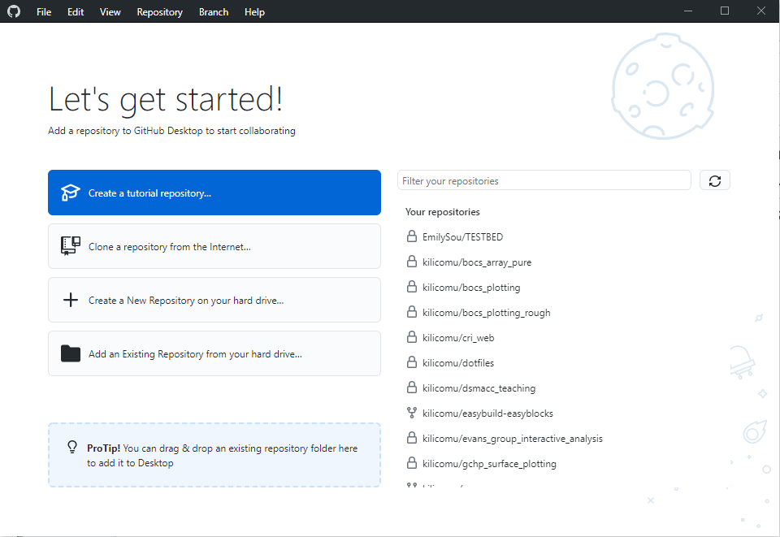
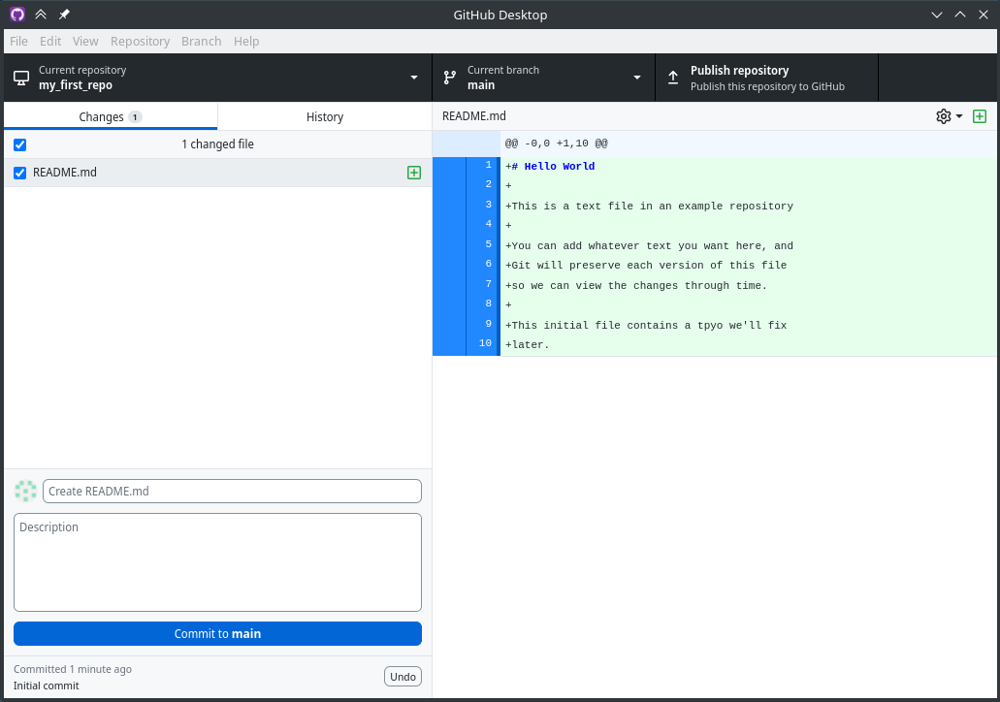
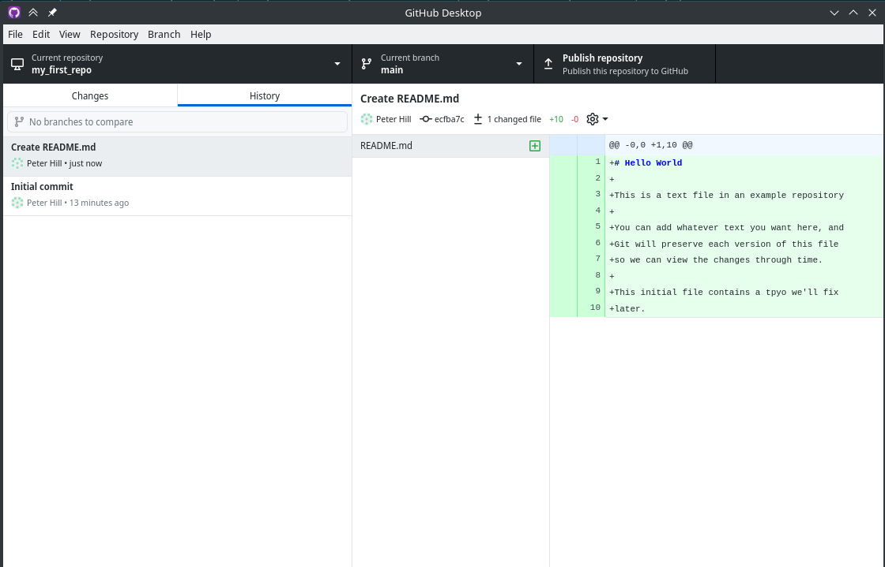
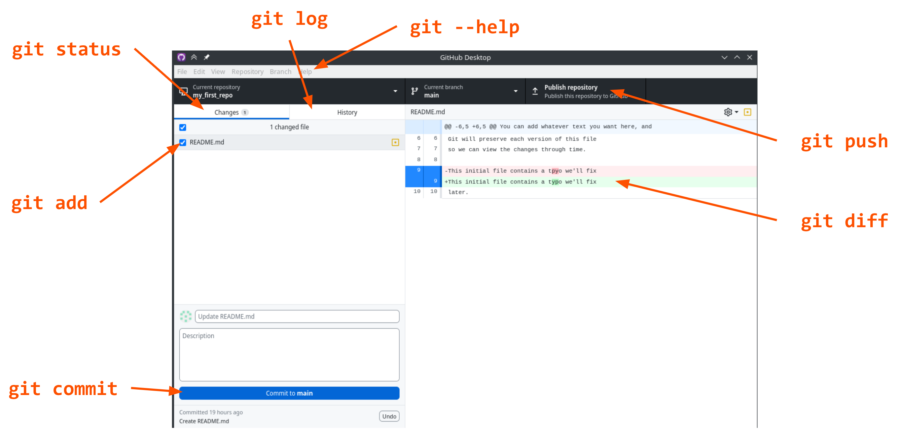

:::::::::::::::::::::::::::::::::::::: questions 

- How do I get a project under version control?
- How do I track changes to a set of files?

::::::::::::::::::::::::::::::::::::::::::::::::

::::::::::::::::::::::::::::::::::::: objectives

- To understand how to create a new git repository
- To understand how to create new commits

::::::::::::::::::::::::::::::::::::::::::::::::

## Creating Your First Repository

::: group-tab

### GitHub Desktop

{alt="Starting page of GitHub Desktop. There\'s an arrow pointing to 'Create a New Repository on your hard drive'"}

Click "Create a new Repository on your hard drive".

- **Description**: a one-line description of the repository contents
- **Privacy**: the visibility of your repository - just you or anybody?
- **Organisation**: the ownership of your repository - you or some organisation
  (e.g. university-of-york) that you are a member of?

### Command line

First, we're going to change the default name of the first branch to `main`,
which is a very common convention nowadays:

```bash
git config --global init.defaultBranch main
```

Next, let's make a new directory and initialise the repo:

```bash
mkdir my_first_repository
cd my_first_repository
git init
```

On success:

```
Initialized empty Git repository in /Users/klcm500/practical_version_control/my_first_repository/.git/
```

```bash
git status
```

This is going to be our "default" command --- if you're ever not sure what to
do, run git status , it often has useful info!

:::

## Typical files in any project

- **README.md**: A file describing the project you have under version
  control. Typically written in Markdown and is nicely rendered on the GitHub
  page for your repository
- **.gitignore**: A file describing the things in your repository that you don't
  want to track
  - [`.gitignore` file generator](https://www.toptal.com/developers/gitignore/)
  - [big `.gitignore` collection](https://github.com/github/gitignore)
- **License**: a document describing the rights and permissions you grant to
  others who may wish to use your software
  - [Software licence picker](https://choosealicense.com)

## Adding first file {#slide-17}

- Use your favourite text editor to create `README.md`

```markdown
# Learning Git

Here's our todo:

- [x] Create a new file
- [ ] Make our first commit
- [ ] Fix this tpyo
```

Aside: It is a **Very Good Idea** to have a `README` in all your projects that
lets people know:

- what/who the project is for
- basic instructions on how to use the project

All git web services will show the `README` as a landing page for the repo

::: group-tab

### GitHub Desktop

- Take a look at what happens in the GitHub desktop window

{alt="GitHub Desktop diff view. In the left hand panel, there's 1 changed file with our arrow pointing to it. In the right hand panel, there's a diff showing the new file"}

File status (added in this case)

Our changes

- Add a commit label and a commit message to the box

### Command line

- Run `git status` again and note the different output
- Git is aware that you have added a file

- Need to set up your name and email address

```bash
git config --global  user.name "YOUR NAME"
git config --global  user.email "your@email.address"
```

- This will make your name and email address appear correctly on any commits you make to repositories
- Only need to do this once on a system!
- It's also a good idea to set the text editor to whatever your favourite is:

```bash
git config --global core.editor "nano"
```

- Nano is a pretty sensible default if you don't have a favourite
- Although Emacs is much better if you want an editor that does everything and you enjoy tinkering!
- Press F1 in nano for help

```bash
git add README.md
```

Tells git that you'd like to add this file to the commit

```bash
git commit
```

Opens up a text editor for you to add a label and message to the commit

THEN

OR

```bash
git commit -m "<message>"

^ To immediately write a commit message (without a longer description)
```

:::

- A nice way to think about commit labels is that they should concisely complete
  the following sentence: "*[This commit will...]*", for example: "*[This commit
  will...]*  Create README.md"
- The commit message can contain as little or as much as appropriate to help you
  and others understand what the change consists of (be kind to _Future You_!)
- Best practice is to keep first line short, like an email subject line, and
  optionally a longer explanation below, separated by a blank line
- How frequently should you commit? What should be in a commit?

## Viewing history

::: group-tab

### GitHub Desktop

- Switch over to the "History" tab (View > History)
- You should be able to see your recent commit and its details
- Right now, this exists  only on your computer

{alt="GitHub Desktop diff view with two commits"}

### Command line

- Run `git log` to see the repository history
- You should see a single commit
- It will have your name and address in the 'Author' field
- It will have the date and time of creation in the 'Date' field
- Your commit label and message will be present
- This is how you communicate high-level changes in the repository to other people / yourself!

:::


## Making Changes

- Let's check off the second item in our todo:

```markdown
# Learning Git

Here's our todo:

- [x] Create a new file
- [x] Make our first commit
- [ ] Fix this typo
```

- Before you commit it, let's look at the diff...

::: group-tab

### GitHub Desktop

The diff should appear automatically!

### Command line

```bash
$ git status
On branch main

Changes not staged for commit:
 (use "git add <file>..." to update what will be committed)
 (use "git restore <file>..." to discard changes in working directory)
        modified:   README.md

no changes added to commit (use "git add" and/or "git commit -a")

$ git diff
```

:::

```diff
diff --git a/README.md b/README.md
index b277f80..ea21a73 100644
--- a/README.md
+++ b/README.md

@@ -3,5 +3,5 @@

 Here's our todo:
 
 - [x] Create a new file
-- [ ] Make our first commit
+- [x] Make our first commit
 - [ ] Fix this tpyo
```

This line has been removed

This line has been added

This header is because diff is a more general tool for comparing text files

This line shows the line number and context (e.g. function name)

## Git commands in the GUI {#slide-27}

{alt="GitHub Desktop screenshot showing correspondence to the command line interface.
\"git status\" is \"changes;
\"git log\" is \"history\";
\"git help\" is \"help\";
\"git add\" is the checkbox in the \"changes\" panel;
\"git commit\" is the \"commit to main\" button;
\"git push\" is \"publish repository\";
\"git diff\" is the right hand panel"}

- `git status`
- `git add`
- `git commit`
- `git log`
- `git diff`
- `git push`
- `git --help`

:::::::::::::::::::::::::::::::::::::: challenge

## Commit messages

Does the screenshot above have a good suggestion for a commit message?

::: solution

No! It doesn't tell us anything about the actual changes.

:::
::::::::::::::::::::::::::::::::::::::

## Making More Commits {#slide-28}

- What makes a good commit?

<!-- -->

- Atomic --- does a  whole  thing, not part of a thing
- Orthogonal --- does  one  thing at a time, not lots of things

<!-- -->

- These principles make it easier:

<!-- -->

- to understand the history of a repo
- undo a change

<!-- -->

- Examples:

<!-- -->

- Add a whole new feature
- Fix a bug
- Fix all instances of the same bug?

<!-- -->

- Should we fix the typo at the same time or not?
- Now go ahead and  a dd  the file and  commit  it

<!-- -->

- What would a good commit message be for this change? Discuss

