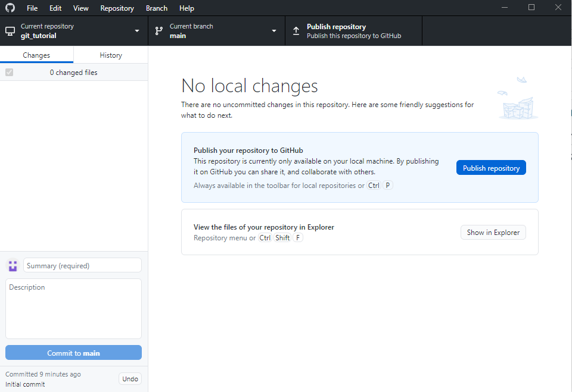
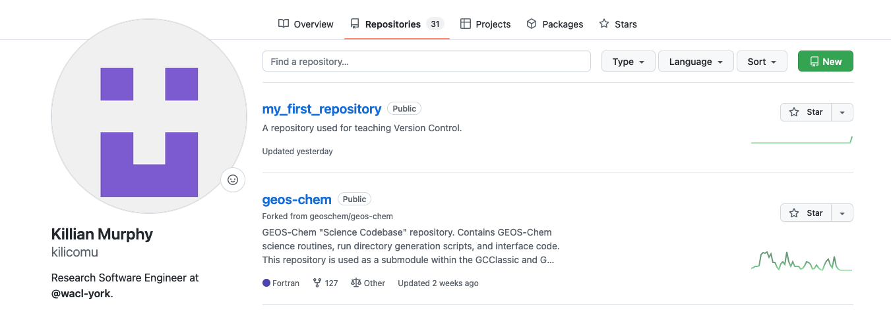
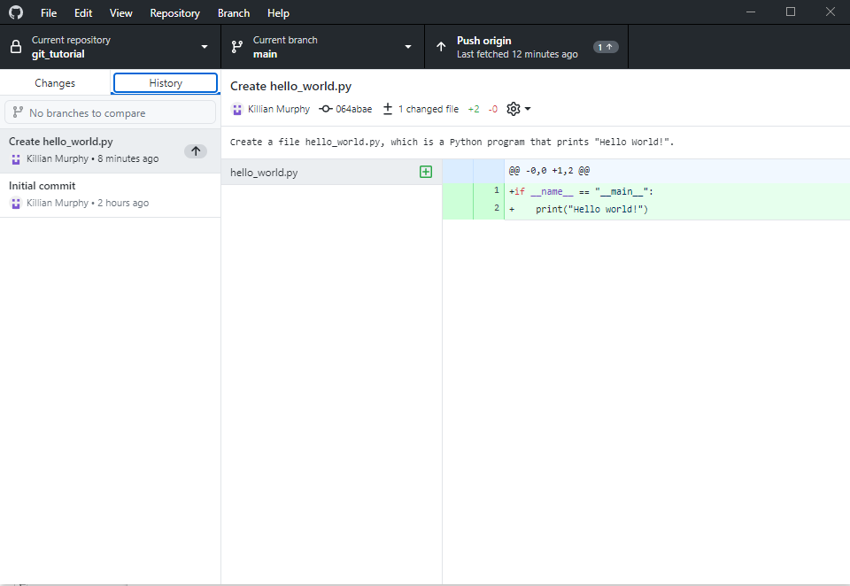
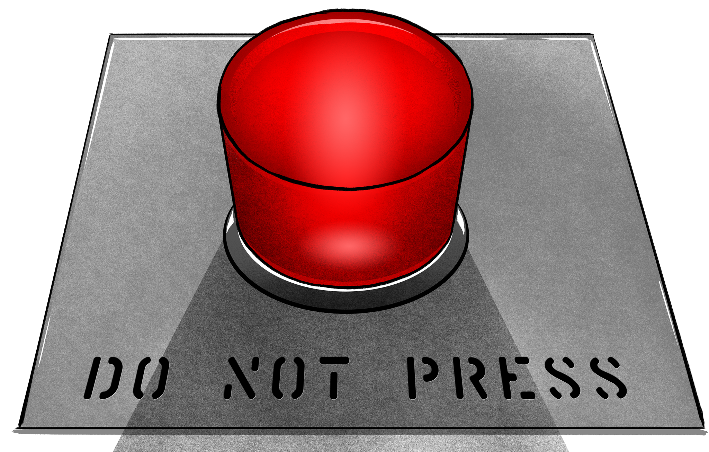
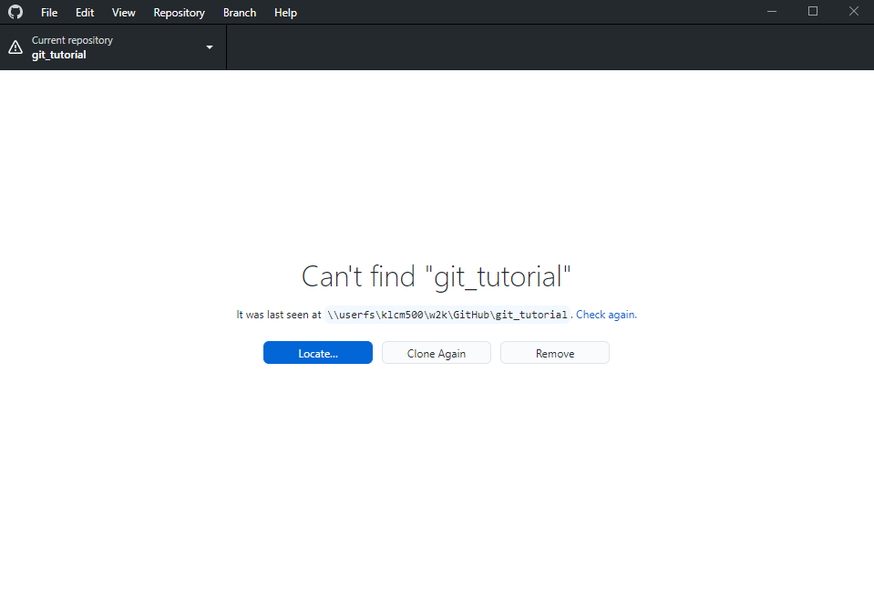
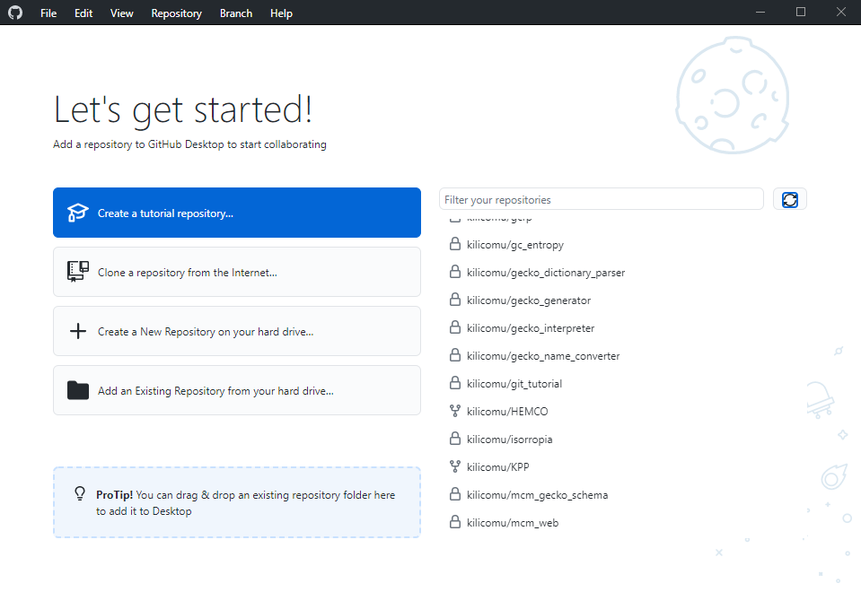

:::::::::::::::::::::::::::::::::::::: questions 

- How do I backup a repository?
- How do I share a repository with other people?

::::::::::::::::::::::::::::::::::::::::::::::::

::::::::::::::::::::::::::::::::::::: objectives

- To understand how to create a repository on a web service
- To understand how to download a repository from a web service

::::::::::::::::::::::::::::::::::::::::::::::::


## What, exactly, is a repository?

A git repo has two parts:

- a  .git  directory full of special files
- the working tree, the current state of your project and files on disk


- If you share the  .git  directory, you share the entire repo history
- To backup the repo, just need to backup  .git

## Making a repo on Github

::: group-tab

### Graphical interface

{alt="GitHub Desktop showing fig"}

Now click this!

## Command line

{alt="GitHub screenshot showing list of repositories and new repo button"}

- Navigate to  https://github.com/your-username
- Select the `Repositories` tab
- Select the green `New` icon
- Don't add a `README` or `.gitignore`
- Make it `public` rather than `private`, will simplify things later!
- From the front page of your new repo, press the green `Code` button and copy the URL
- Paste it into the following command:

```bash
git remote add origin <YOUR REPO URL>
```

This creates a reference in your copy of the repository to an `origin`
repository on GitHub

:::

## Pushing Your First Commit

::: group-tab

### Graphical interface

{alt="GitHub Desktop with 'Push origin' button highlighted"}

### Command line

```bash
git push --set-upstream origin main
```

Only need to do it this way the first time we push to a new branch.
`--set-upstream` links your local branch main with a branch main in
GitHub. Normally, we just need:

```bash
git push
```

:::

{alt="Big red button labelled 'Do Not Press'"}

Your repository is now on GitHub: `https://github.com/<username>/<repo-name>`.
This means it is:

- Backed up!
- Easily  shareable !
- Easily accessible from other machines!

Now delete the whole project from your computer using the file explorer / finder
/ `rm` command

## Cloning Your Repository

- Getting your code and all of its history back is as easy as a few button clicks
- Once it has finished cloning, we should be back to where we were before deleting
- You can clone other GitHub users' public repositories too!

::: group-tab

### Graphical interface

{alt="GitHub Desktop 'Can't find git_tutorial'"}

{alt="GitHub Desktop list of repositories"}

### Command line

```bash
git clone https://github.com/<username>/<repo-name>
```

- If the repository is private, you will need to set up a personal access token
  before you can clone the repository
- You can also set up passwordless authentication using SSH keys, see the GitHub
  documentation for more details
  - This is a Good Idea!
  
:::

## Making More Changes

- Go ahead and make some more commits to your repository:

<!-- -->

- Fix that typo, and some more things you've learnt how to do
- On the command line, don't forget the two-step dance: add, then commit

<!-- -->

- Make sure to push commits when you've made them!

<!-- -->

- You don't have to push after every single commit, as long as you remember to push at some point

<!-- -->

- Think and chat about the way you like to work and how that might map onto version control history:

<!-- -->

- Do you work in big chunks and then sign off for the day?
- Do you often switch tasks and have trouble figuring out where you were when you left off?
- Do you program first and plan later? Or the other way around?!

<!-- -->

- Ask any questions you'd like!
