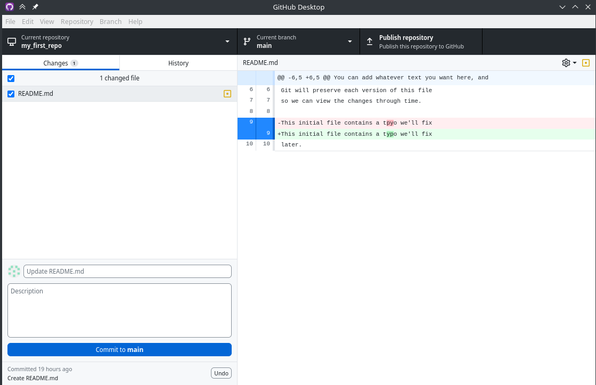
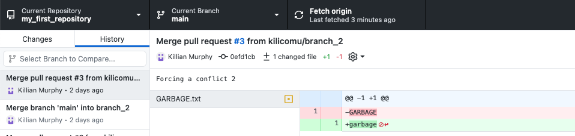
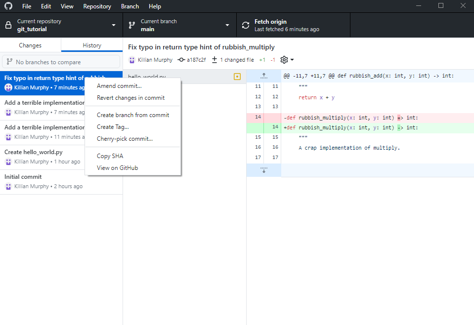
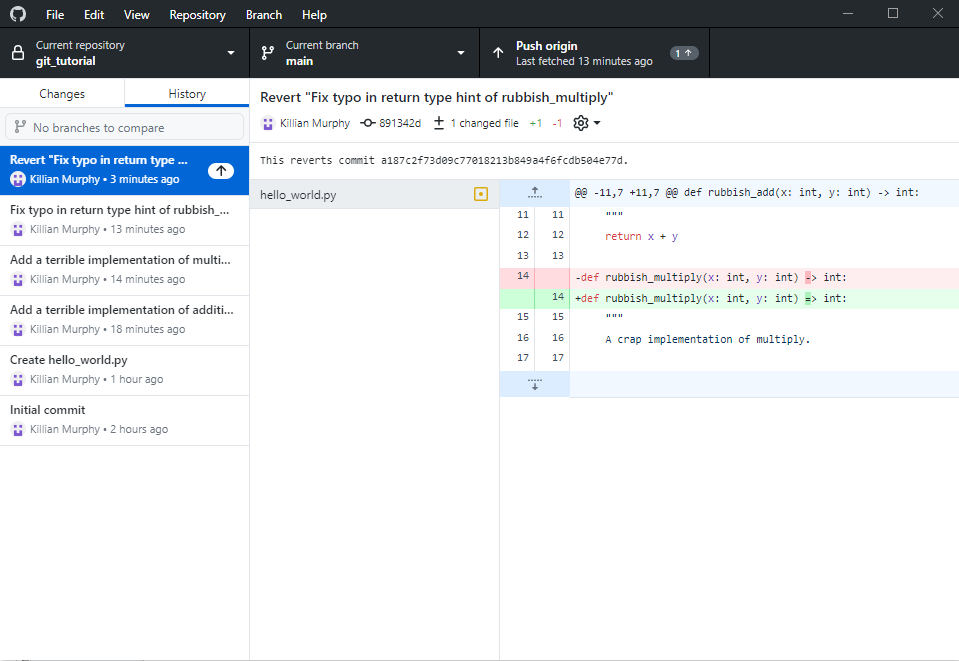

:::::::::::::::::::::::::::::::::::::: questions 

- How do I undo changes to a repository?

::::::::::::::::::::::::::::::::::::::::::::::::

::::::::::::::::::::::::::::::::::::: objectives

- To understand how to undo changes before making a commit
- To understand how to undo changes after making a commit

::::::::::::::::::::::::::::::::::::::::::::::::


## Undoing  Changes {#slide-38}

- One of the purposes of version control is to let you undo changes
- There are different changes we might want to undo:

<!-- -->

- Changes to the working tree
- Change files staged for the next commit
- Changes made in previous commits
- History ( !! ) (not covered here)

## Undoing Changes to Working Tree {#slide-39}

- The simplest!
- Github Desktop: right-click -\>  Discard Changes
- CLI:  git restore \<file\>\...

<!-- -->

- For example:   git restore README.md
- If you forget, run  git status  for a reminder

<!-- -->

- DANGER :   git isn\'t tracking these files, so there\'s no way to undo this undo! 

## Undoing Staged Changes

::: group-tab

### Graphical interface

{alt="GitHub Desktop"}

Stage/unstage

You can even stage/unstage individual lines

### Command line

- CLI:  git restore \--staged \<file\>\...

<!-- -->

- For example:   git restore \--staged README.md
- If you forget, run  git status  for a reminder

<!-- -->

- This is exactly the opposite of  git add \<file\>\...

:::


## Commit Hashes {#slide-42}

- Each commit in the history has a unique identifier associated with it, the commit hash
- This is a long string that looks something like this: 0efd1cb9e37318404b76de7c99e26fbef16ef3a3
- You only ever need the first 7 characters of the ID!
- It is used in any Git operation that needs to refer to a specific commit

{alt="GitHub Desktop showing commit hash"}

```bash
klcm500@matscrn my_first_repository % git log
commit 0efd1cb9e37318404b76de7c99e26fbef16ef3a3 (HEAD -\> main, origin/main, origin/HEAD)
Merge: c267c36 77caf66
Author: Killian Murphy \<killian.murphy@york.ac.uk\>
Date:   Mon Jan 23 16:43:31 2023 +0000]
```


## Reverting A Commit

::: group-tab

### Graphical interface

- GitHub desktop can't revert many commits at once
- We can easily revert commits one-by-one!
- Switch to the "History" tab and right-click the latest commit 

{alt="GitHub Desktop showing right-click menu on commit"}

Click this

- We now have a new commit that reverts the previously made changes
- We can play around with this and see if it works
- If we are happy with the reversion, we can push to reflect the reversion on GitHub
- With GitHub Desktop, we need to do this for each commit we want to revert, in reverse order
- With the command line, reverting multiple commits at once is possible - not covering that today

{alt="GitHub Desktop showing reverted commit"}

### Command line

- First need to identify the ID of the commit we want to revert - the last
  commit we made. Take a look at git log output: `commit
  f7cfe07b8d7691241ebca90c19b187da142350c1 (HEAD -\> main)`. We only need the
  first 7 characters of this ID string!
- Then we run: `git revert f7cfe07`. Since we are making a new commit which
  reverts the previous commit, we are prompted for a label and a message. This
  is a good opportunity to document why we are reverting a commit
- If we are happy with the reversion, we can push the changes as with any other commit

:::
