:::::::::::::::::::::::::::::::::::::: questions 

- How do I work on multiple things at the same time?
- How do I work with other people on the same repository?

::::::::::::::::::::::::::::::::::::::::::::::::

::::::::::::::::::::::::::::::::::::: objectives

- To understand what a branch is
- To understand how to create branches
- To understand how to merge branches

::::::::::::::::::::::::::::::::::::::::::::::::

## Branches

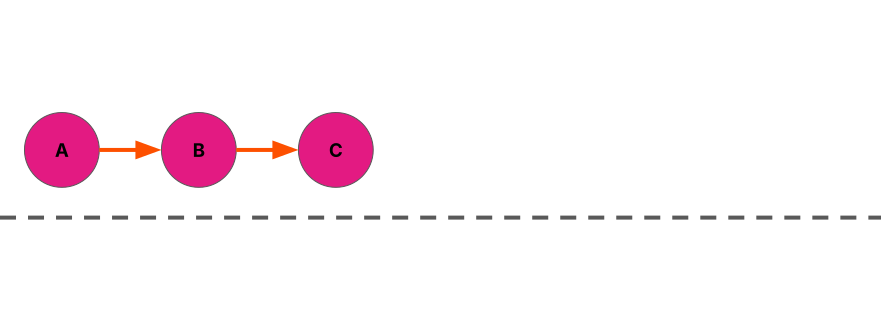{alt="Three commits in a line, with arrows
connecting them, left to right"}

So far, we've been making a straightforward series of commits

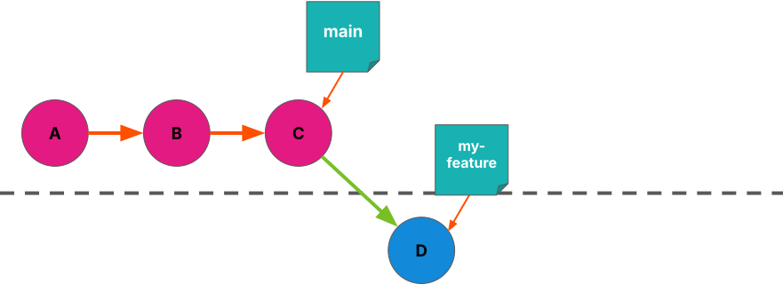{alt="A fourth commit, branching
off from the first three"}

- Branching creates a separate stream of changes within the repository
- Changes on one branch aren't reflected on another branch, unless you want them to be!
- Branch names are like post-it notes on particular commits

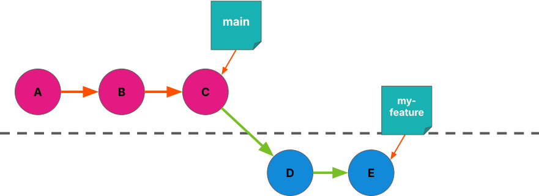{alt="A fifth commit connected
to the fourth one"}

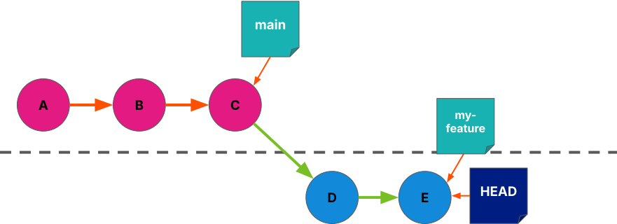{alt="A fifth commit connected
to the fourth one"}

- Branching creates a separate stream of changes within the repository
- Changes on one branch aren't reflected on another branch, unless you want them to be!
- Branch names are like post-it notes on particular commits

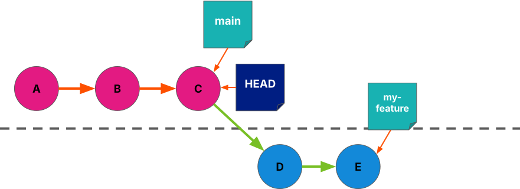{alt="A fifth commit connected
to the fourth one"}

- When we change branch, our working tree is updated to reflect the state of that branch
- git uses the label  HEAD  to refer to the current branch

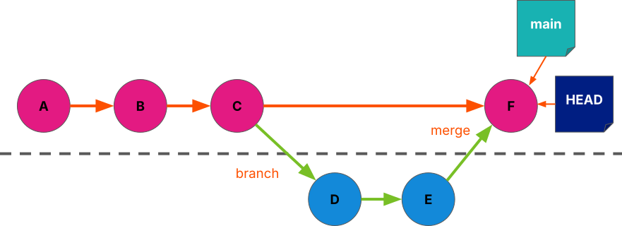{alt="Tree diagram showing the
`my-feature` branch merged into `main`"}

- We can merge one branch into another, and bring the changes together
- Merge commits are special because they have two parent commits --- normal commits only have one!


- Branches are great for working on new things once you've got something
  working - make changes on a branch knowing that they won't affect changes on
  the 'main' branch
- Branches are great for working together - multiple people can work on
  different changes without interfering with each other
- At some point you will want to bring all of these changes back into one
  place - this is called a 'merge'

## Git Glossary: Branching {#slide-55}

- Branch : a set of changes in your repository, being tracked in parallel to your 'main' branch
- Merge : to bring changes from one branch into another
- Conflict : a situation where competing changes have been made to some part of your repository
- Pull Request : a way of reviewing, labelling, and discussing a merge before it takes place
- Fork : make a copy linked to the original repo

:::::: group-tab

### Graphical interface

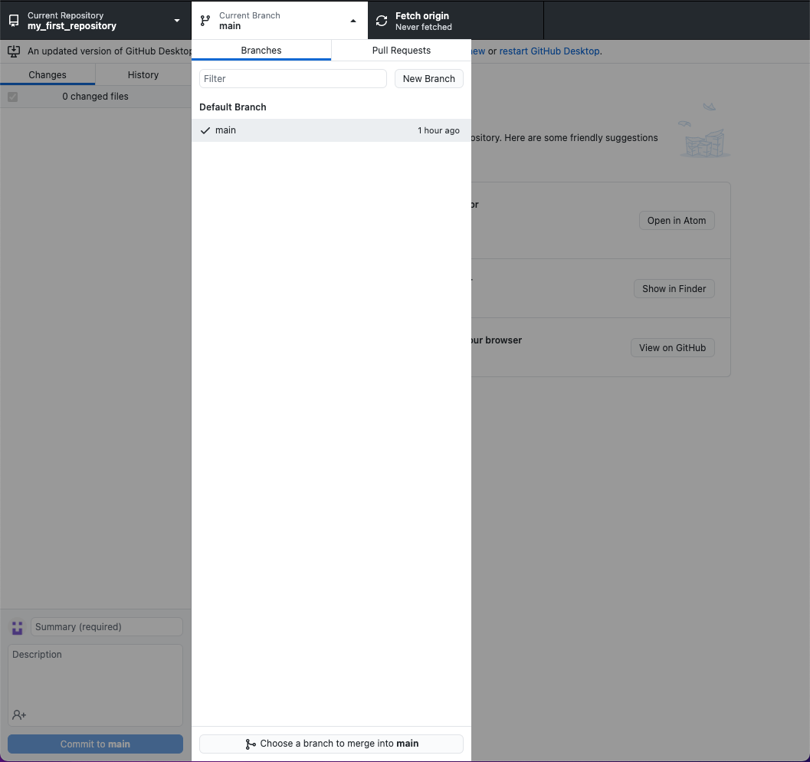{alt="GitHub Desktop showing 'New Branch' button"}

Click this and call it `sandwiches`

### Command line

Create a new branch called "sandwiches" and immediately switch to it

```bash
git switch --create sandwiches
```

::: spoiler

Note: this is a newer wrapper around older commands, so you might see people
online referring to  git branch  and  git checkout . Those commands will still
work, and you might have to use them if you have a git version older than 2.27

:::

::::::

- The branch currently only resides in our local repository
- We can  publish the branch to GitHub in the same way we published the  main  branch at the start of the tutorial:

- GUI users can click  Publish branch
- CLI users can run  git push ---set-upstream origin sandwiches

- Now other people could see your branches when they clone your repository

## Add a new file

~~~markdown
# A tasty sandwich

```
bread

bread
```

## Todos:

-  [ ] add filling
~~~

sandwich.md

- Let's add a new file: sandwich.md
- We'll fill it in later!
- Make sure you're on your new branch (" sandwiches " rather than " main ")
- Add the new file, and commit it with a useful message

## Working On Branches {#slide-60}

- Switch back to your main branch. What do you notice?


- CLI users: `git switch main` (note no `--create` flag!)
- CLI users: try `git switch m<tab>`

- Have a look in your file explorer / finder / directory listing in your
  terminal in between switching branches

- Git is keeping track of changes to these branches separately
- Files that only exist on one branch will not be visible to you if you have switched away from that branch
- If we now want our main branch to reflect changes made on `sandwiches`, we need
  to merge `sandwiches` into `main`
- Before we do this, we can review the changes using a `Pull Request`
  - Slight misnomer from Github here, we're really requesting to merge
    branches. Oh well, there are two hard problems in computer science...

## Creating A Pull Request

- Navigate to `https://github.com/<username>/<repo-name>`
- Select the `Pull requests` tab
- Select `New pull request`
- We need to select two branches to be compared for a merge - we want to set
  `main` as our base branch (the branch into which changes will be merged) and
  `sandwiches` as the compare branch, the branch from which changes will be taken
- GitHub will show us some information about the changes that we are looking to merge
- With these branches correctly selected, select `Create pull request`

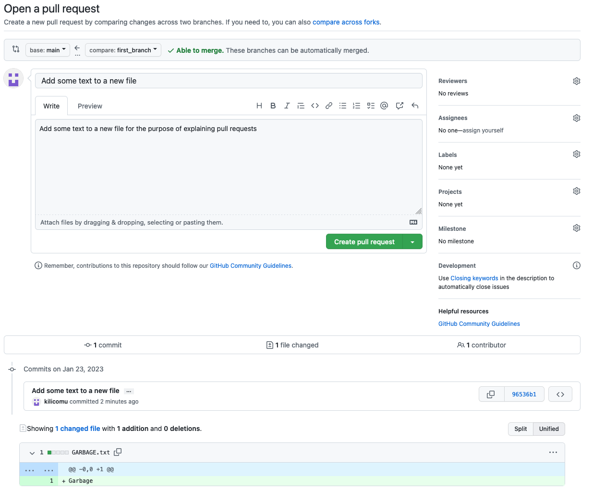{alt="GitHub screenshot showing "Open a pull request" page"}

- Now we can add a title and formatted description of the changes to make it
  easy for us and others to understand the changes to be merged
- PRs are a good opportunity for you to describe the changes to yourself, review
  them, and make sure you are happy with them, before merging them with your
  main branch
- If there are multiple people working on your repository this is a great time
  for them to have a look at your changes and add any comments they might have!
- Let's add a nice description and click Create pull request , then see if we
  can get somebody else to review your changes

## Merging A Pull Request

- Once you are done experimenting with your Pull Request, select `Merge pull request`:


- This takes the changes from the `compare` branch - the branch you created
  earlier - and merges them onto the `base` branch - the `main` branch of your
  repository
- In this case, the changes should be able to be merged automatically
- After merging, you can select `Delete branch` - we are finished merging the
  changes and in this case don't need to keep it!


- We now need to make sure our local repositories have kept up with the changes
  that have happened on GitHub...

## Keeping Repositories Up To Date - GUI {#slide-65}

- We have made some changes in GitHub that we need to reflect in our local repository!
- In the GitHub Desktop app, we can use the 'Fetch origin' button to get the latest changes from GitHub
- If we switch back to the main branch after doing so, we will see a Merge commit in the history
- We can also delete our branch that has been merged, since we are finished with it

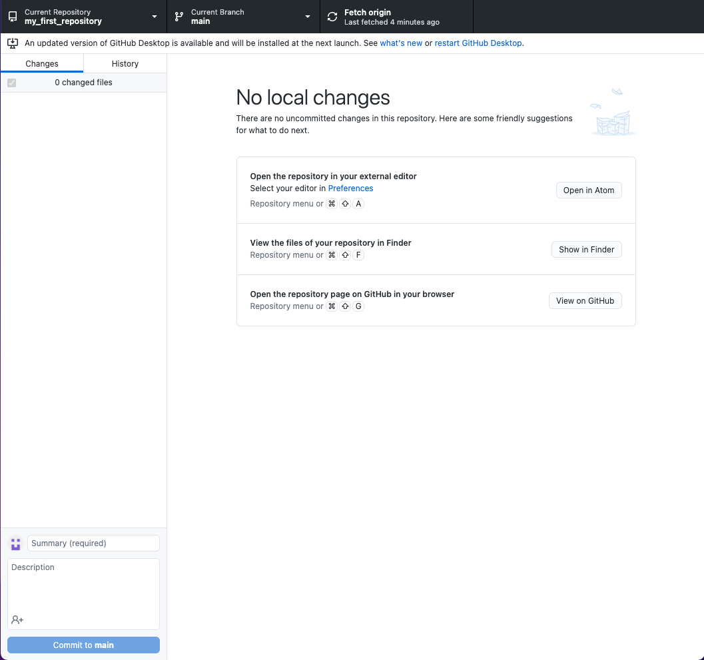{alt="GitHub Desktop showing "Fetch origin" button"}

Click this!

## Keeping Repositories Up To Date - CLI {#slide-66}

git switch main

^ Switch back to our  main  branch, if we aren't already on it

git pull

^ Get the changes from GitHub and reflect them in our local repository

git  branch  -d sandwiches

^ Delete the local copy of  sandwiches , as we have finished with it

## Collaborating With Others {#slide-67}

- Git is distributed --- every copy of a repo has all of its history, can make branches, and can pull branches from other copies
- We usually want to have one "official" repo that is the main version
- On Github we can add collaborators to our repos

<!-- -->

- Settings > Collaborators > Add People
- But this has to be done by maintainers of the repo

## Collaborating With Others {#slide-68}

- What if we want to contribute to someone else's repo?
- Fork : make a copy linked to the original repo
- Github allows us to make PRs from forks into the original without needing to be added as a collaborator

<!-- -->

- Only approved people can actually merge them though!

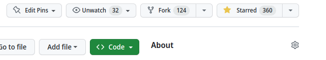{alt="Screenshot of GitHub showing "Fork" button"}

## Introducing Conflicts {#slide-69}

- Conflicts happen when something in a file has been changed in more than one place
- Git doesn't know what you want the file to contain, so you have to help it!
- One way this can happen is when multiple people work on e.g. the same bit of code on their own branches, and you want to merge those branches back together

## Conflicting Commits {#slide-70}

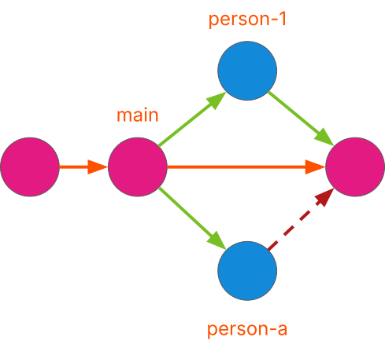{alt="A conflict when merging branches"}


::: group-tab

### person-1

~~~markdown
# A tasty sandwich

```
bread
hummus
bread
```

## Todos:

- [x] add filling
~~~

### person-a

~~~markdown
# A tasty sandwich

```
bread
Maslow's hierarchy of needs
bread
```

## Todos:

- [x] add filling
~~~

:::

## Conflicting PRs {#slide-71}

- Partner up with the person next to you
- Decide who is "person A" and who is "person 1"

Person A

- Fork Person 1's repo (you might need to rename it!)
- Clone it locally ( Code  to get the URL)
- Make a new branch  person-A
- Add a filling to sandwich.md and check the box ( [ ]  →  [x] )
- Commit and push to your fork of the repo
- Open a PR of your  person-A   branch into Person 1's main branch --- don't merge yet!

Person 1

- Make a new branch  person-1
- Add a different filling to  sandwich.md   and check the box ( [ ]   →   [x] )
- Commit and push to your repo
- Open a PR of your  person-1   branch  into your main branch and merge it   --- don't merge yet!

## Resolving Conflicts {#slide-72}

- We now have two branches to merge onto the main branch!
- Set up a Pull Request for each of these branches
- You should be able to merge the Pull Request for one of these branches without conflicts
- After merging the first one, the second Pull Request should now tell you that there are conflicts to be resolved
- We have to tell Git what we want the conflicting file to look like in order to continue

## Resolving Conflicts {#slide-73}

- If you select 'Resolve conflicts' on the Pull Request, GitHub will show you something like this 
- This is  git's  conflict syntax - anything above the line of  ===  characters is what that section of the file looks like in the  person-1  branch
- Below the line of  ===  characters is what that section of the file looks like on the  base  branch
- We can choose how we want to resolve the conflict by removing everything we don't want to keep,  including the Git conflict markers!
- Once you are done, select  Mark as resolved  --- you can now  Commit merge  to resolve the conflicts and continue
- Notice how the checkbox didn't cause a conflict, even though you both changed it?
- If you merge on the command line, git puts these conflict markers straight into the file and expects you to fix them before you merge

~~~markdown
# A tasty sandwich

```
bread
<<<<<<< person-1
hummus
=======
Maslow's hierarchy of needs
>>>>>>> main
bread

## Todos:

- [x] add filling
~~~

## Summary {#slide-74}

- Create a  branch  in a repository, allowing separate streams of changes to be tracked
- Switch   between branches in a repository if you need to work on multiple streams of changes simultaneously
- Create  pull requests  when you want to merge changes from a branch  into  another branch
- Merge   a pull request when you and collaborators are happy with the changes
- Pull  changes from GitHub to synchronise your local repository
- Resolve conflicts  when there are overlapping changes to some part of your repository

## Additional Resources {#slide-75}

- Git
- Version Control with Git: Summary and Setup
- Introducing Version Control with Git
- Hello World - GitHub Docs
- Git & Github through GitKraken Client - From Zero to Hero!
